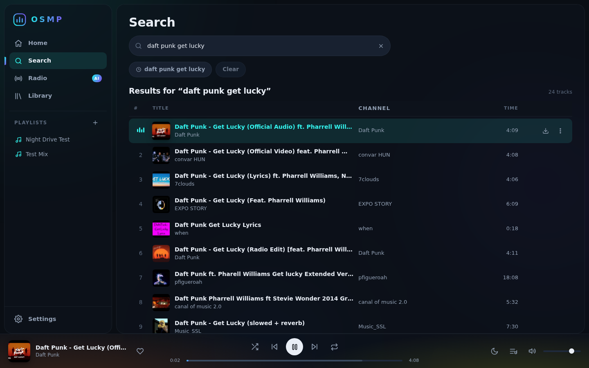
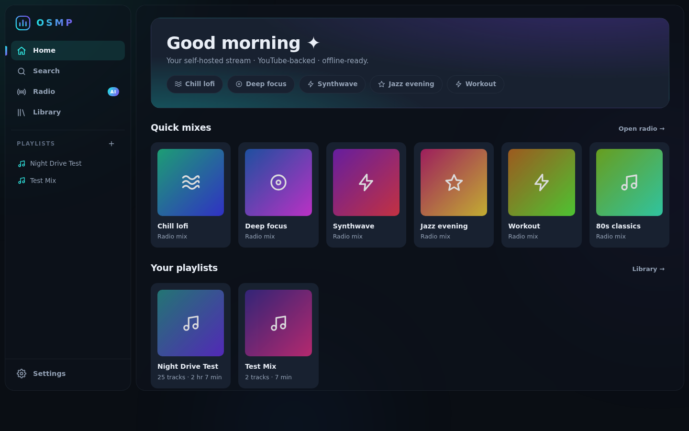
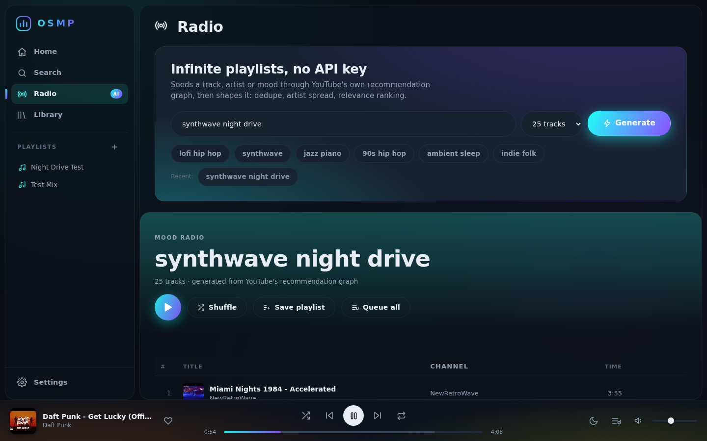
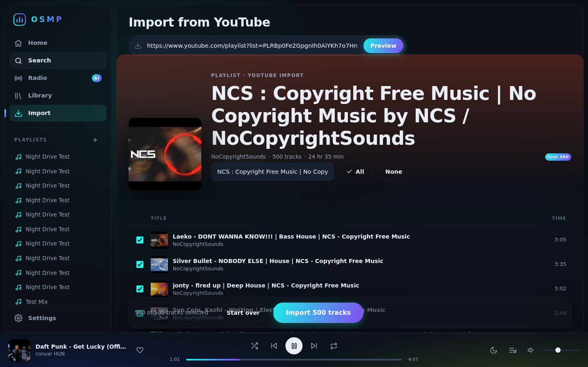
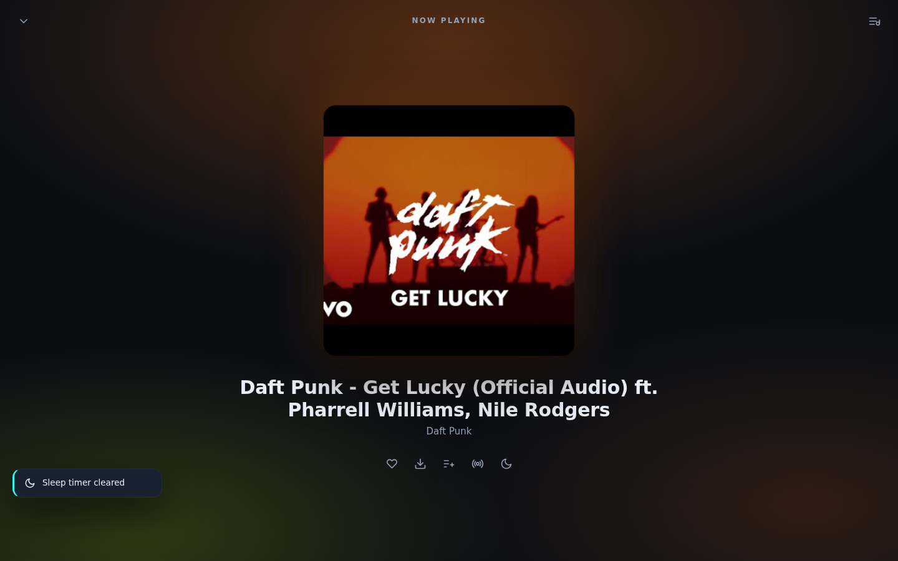
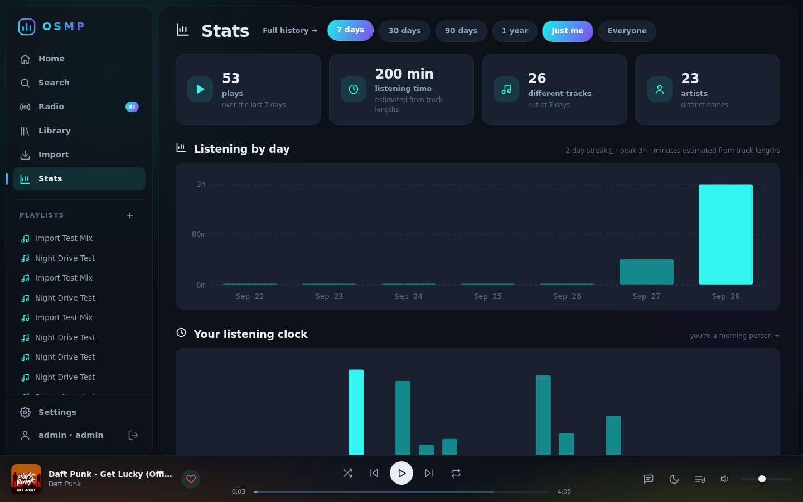
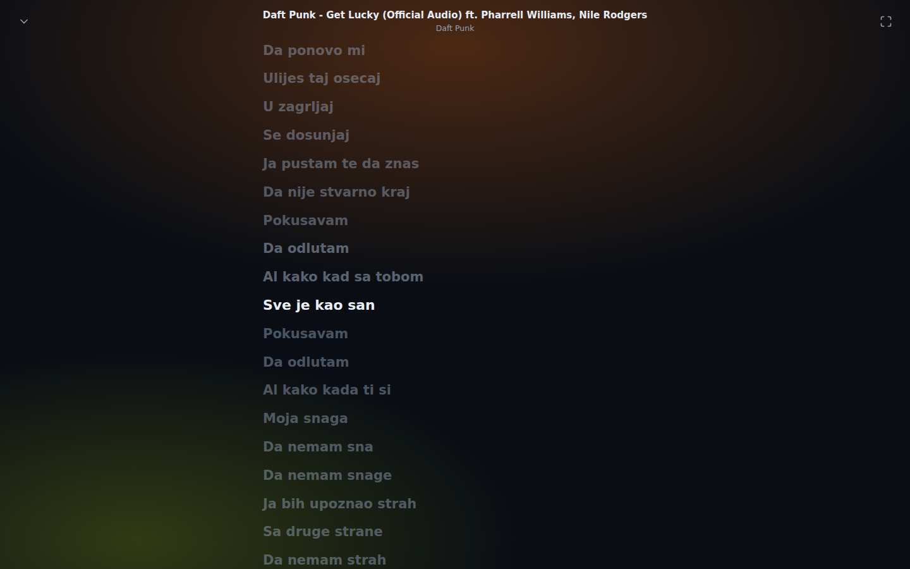
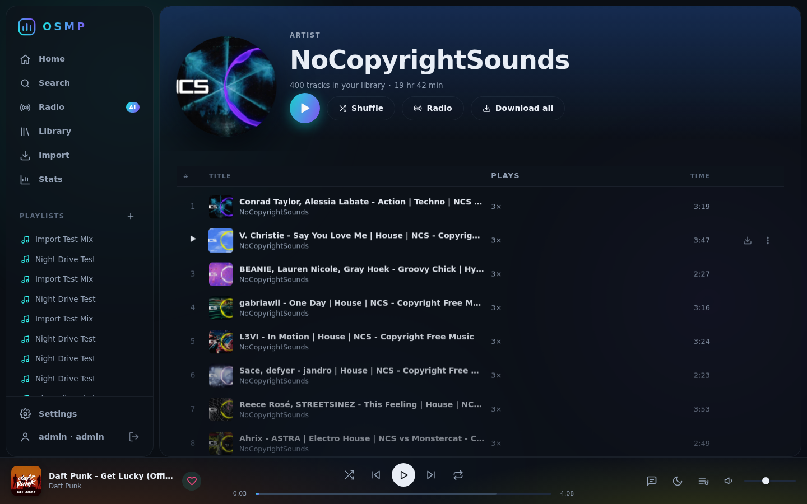
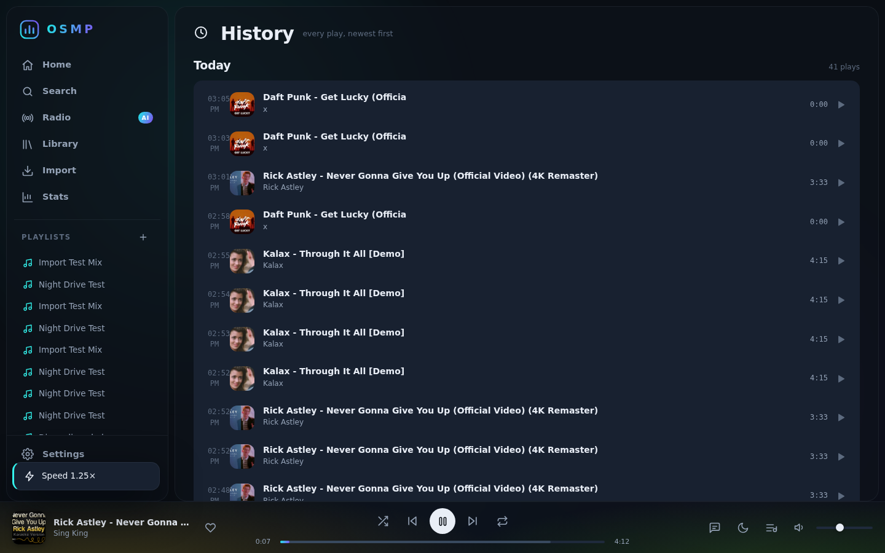

<p align="center">
  
</p>
<h1 align="center">OSMP — Open-Source Music Player</h1>
<p align="center">
  <b>Your music, your server, every screen.</b><br>
  A self-hosted Spotify alternative: YouTube-backed streaming, offline downloads,
  algorithmic radio, optional AI curation — in the browser, as a Linux AppImage,
  and as an Android app.
</p>
<p align="center">
  
</p>

---

## Why OSMP?

- **Self-hosted** — one small Python server on your machine/NAS; every client
  talks to it. No accounts, no cloud, no telemetry.
- **Your own music, too** — upload MP3/FLAC/M4A/… files (or point OSMP at a
  folder on the server) and they become first-class tracks: tagged, with
  embedded cover art, searchable, and mixable into playlists right next to
  YouTube results.
- **YouTube as your catalog** — search anything on YouTube and play the audio
  stream instantly (server-side proxy with full seeking support).
- **True offline** — download tracks server-side into your library, or
  on-device in the Android app. Downloads play with the network unplugged.
- **Accounts & multi-user** — the admin owns the box; invite listeners with
  their own login, history **and their own playlists**. Playlists are
  per-person; share any of yours with specific friends as view-only or
  can-edit (collaborative lists). Sessions survive restarts; clients (web,
  Android, Linux, Windows) sign in once.
- **Radio that understands seeds** — give it a song, artist or mood; it walks
  YouTube's own recommendation graph, dedupes, spreads artists, ranks by
  relevance. No API key, no rate limits.
- **Import from YouTube** — paste any public playlist, album, channel or
  @handle link (or even a bare playlist ID): preview every track, untick what
  you don't want, and it becomes a real OSMP playlist. Paste the same link
  into Search or Radio and you're routed to the importer automatically.
  Big sources are capped at the first 500 uploads.
- **Smart playlists** — lists that maintain themselves: "On repeat", "Deeper
  cuts", "Your uploads" and friends start from one click, or build your own
  from rules (plays, last played, date added, length, artist, source,
  downloaded) with a live match preview. Evaluated on the server, so every
  client sees the same list.
- **Synced lyrics** — time-aligned lyrics from LRCLIB (free, keyless) with
  karaoke-style highlighting that follows playback; click any line to jump
  there. Plain un-timed lyrics render too, and results are cached on the
  server (misses are retried weekly).
- **Stats & Made-for-you** — a dashboard of what you listen to: plays and
  minutes by day (with streaks), your listening clock, top artists and
  tracks, plus a full play journal. Home turns your top artists into
  one-click radio mixes.
- **Artist pages** — every artist name (in lists, the player, stats) opens a
  page with everything you have by them, play counts, shuffle, radio and
  bulk download.
- **Equalizer, visualizer & speed** — a three-band Web Audio EQ with presets
  (bass boost, vocal, rock…), a frequency-bar visualizer in the now-playing
  view, and playback speed from 0.75× to 2× (pitch-preserved).
- **Backups** — one click exports your playlists and library metadata as a
  JSON file; import merges it into any instance. Accounts and keys never
  leave the server.
- **Optional AI curator** — plug in any OpenAI-compatible endpoint
  (OpenAI, OpenRouter, Groq, Ollama, LM Studio…) and describe a vibe in plain
  words; the LLM designs the tracklist, OSMP resolves every pick.
- **A UI worth looking at** — aurora gradient themes, ambient glow extracted
  live from cover art, animated equalizers, view transitions, sleep timer with
  volume fade-out, queue with drag-reorder, Media Session / lock-screen
  integration, installable PWA.
- **One-press updates** — Settings → Updates checks GitHub and updates the
  whole install (source: git + pip; AppImage: swaps in the new release) and
  restarts itself. A dedicated quick button refreshes yt-dlp alone for when
  YouTube changes and playback breaks.

## Screenshots

| | |
|---|---|
|  |  |
|  |  |
|  |  |
|  |  |

## The surfaces

| Surface | What it is |
|---|---|
| **Browser** | The full web app (installable PWA). Zero build step — hand-written ES modules, no npm anywhere. |
| **Linux AppImage** | `OSMP-x86_64.AppImage` — a desktop client (Qt WebEngine) that connects to your server. Can also run the entire server on this machine instead (bundled server, yt-dlp, ffmpeg). System tray with transport controls. |
| **Windows** | `osmp-windows-x64.zip` — the same Qt desktop client for Windows, built and smoke-tested on real Windows machines by CI. Unzip anywhere and run `osmp_desktop.exe`; connect to your server or tick *"run a server on this computer"*. Bundles server, yt-dlp and ffmpeg; updates by downloading a new zip (Settings still tells you when one is out). |
| **Android APK** | WebView client + native layer: signs into the server, on-device downloads served through a virtual host (offline playback with zero network), wake lock, media notification with lock-screen controls. |

Every surface shares one codebase for the UI (`webui/`).

## Setup — one server, everyone connects

### 1. Install the server (one command)

```bash
curl -fsSL https://raw.githubusercontent.com/ION-FX/OSMP/main/scripts/install.sh | sudo bash
```

The installer asks **which IP to bind** and **which port** (defaults: your LAN IP
and `8543`), downloads the latest server bundle, creates a venv, installs a
`osmp` systemd service, and starts it. No root? It installs into
`~/.local/share/osmp` with a user-level service instead. Handy flags:
`--host 0.0.0.0 --port 8790 --no-systemd --uninstall`, and `OSMP_GITHUB_TOKEN=…`
if the repo is private. Prefer to do it by hand:

```bash
python3 -m venv server/venv && server/venv/bin/pip install -r server/requirements.txt
server/venv/bin/python server/run.py --host 0.0.0.0 --port 8543
```

### 2. Create the admin account

Open `http://<server-ip>:<port>` in a browser — the first visit shows a setup
screen that creates the **admin** account. That's it; the server is locked to
logins from then on.

### 3. Invite people (optional)

Settings → **Accounts** (admin only) adds listener accounts. Listeners get
their own play history and can stream, build playlists, import, and download —
only admins manage users, server settings and updates.

### 4. Connect your devices

- **Browser** — just open the server address; installable as a PWA.
- **Android** — install the APK, enter the server address + your account.
- **Linux** — run the AppImage, enter the server address + your account
  (or tick *"run a server on this computer"* on a desktop machine).
- **Windows** — unzip `osmp-windows-x64.zip` and run `osmp_desktop.exe`
  (same first-run options as the AppImage).

## Offline mode (all clients)

- **Downloads** (server library) live on the server machine and play anywhere
  the normal way — even when YouTube is unreachable.
- **Save to this device** (track ⋮ menu in the browser/AppImage client) keeps a
  copy of the audio inside the client itself: if the server goes down, the UI
  tells you it's offline and everything you saved keeps playing.
- Anything you do while offline — plays, likes, playlist edits — is journaled
  and **syncs automatically** when the server comes back.

## Linux AppImage

Download `OSMP-x86_64.AppImage` from
[Releases](https://github.com/ION-FX/OSMP/releases), then:

```bash
chmod +x OSMP-x86_64.AppImage
./OSMP-x86_64.AppImage
```

Everything (server, yt-dlp, ffmpeg, Qt) is inside the file. By default it
connects to your OSMP server like the phone does; choose *"run a server on
this computer"* on the first screen to use it standalone. Local mode shares the
same library directory as the plain server, so downloads follow you.
Useful flags: `--server URL` (skip the dialog), `--local`, `--browser`
(serve + open your default browser), `--port N`, `--data DIR`.

## Windows

Download `osmp-windows-x64.zip` from
[Releases](https://github.com/ION-FX/OSMP/releases), unzip it anywhere and
run `osmp_desktop.exe`. It's the same Qt client as the AppImage — connect to
your server, or tick *"run a server on this computer"* to use it standalone
(the server, yt-dlp and a static ffmpeg are all bundled; data lives in
`%LOCALAPPDATA%\OSMP`). The zip is built **and smoke-tested by CI on a real
Windows machine** on every release. To update, download the new zip —
Settings → Updates still tells you when a newer release is out.

Running the server alone on Windows (no GUI) works too:

```powershell
py -m venv server\venv
server\venv\Scripts\pip install -r server\requirements.txt
server\venv\Scripts\python server\run.py --host 0.0.0.0 --port 8790
```


> **Note for Ubuntu 23.04+ / distros without `libfuse2`:** AppImages use FUSE
> to mount themselves. If double-clicking reports a missing `libfuse.so.2`,
> either `sudo apt install libfuse2` or run
> `./OSMP-x86_64.AppImage --appimage-extract-and-run` (same app, extracts to a
> temp dir instead of mounting).

## Android

Download `osmp-android-<version>.apk` from Releases (or build it, see below). On first
launch, enter your server address — e.g. `http://192.168.1.20:8790` — and the
app connects. The download button then saves tracks **on the device**; they
keep playing in airplane mode via a native request interceptor.

## Building from source

No npm, no node — Python, Gradle/JDK and standard Linux tools only.

```bash
# web + server (nothing to build — run it)
python3 server/run.py

# Linux AppImage (needs pip packages: PyInstaller, PySide6)
bash scripts/build_appimage.sh

# Android APK (needs JDK 17 + Android SDK; paths auto-detected or via env)
bash scripts/build_android.sh

# headless UI test-suite (Playwright, real YouTube, screenshots)
python3 scripts/ui_test.py

# API test-suite for lyrics/stats/mixes/artists/history/backup (needs a
# running server + admin account; defaults match the dev server)
python3 scripts/api_test.py [base_url] [admin_user] [admin_pass]
```

## Configuration

Everything lives in the Settings view (or `~/.local/share/osmp/osmp.db`):

| Setting | Purpose |
|---|---|
| Theme / accent | Aurora Dark, Midnight (OLED), Daylight + 8 accent hues |
| AI Curator | `base_url`, `api_key`, `model` for any OpenAI-compatible API |
| Updates | Optional GitHub token (private repos); check / update / yt-dlp refresh |
| Accounts | Admin-managed users; listeners get their own history (Settings → Accounts) |
| Stream format | `auto` (picks what the device can play) / `m4a` / `opus` |
| Sound | 3-band equalizer with presets (per-device, applies live) |
| Backup & restore | Export/import the library as JSON (admin) |

### Account recovery

Accounts live on the server, so its shell always wins. From the machine
running OSMP (safe while the server is up):

```bash
python3 server/run.py --list-users                     # what accounts exist
python3 server/run.py --reset-password admin           # set a new password
python3 server/run.py --create-admin                   # only before first setup
```

With the systemd install, use the venv python:
`/opt/osmp/server/venv/bin/python /opt/osmp/server/run.py --reset-password admin`
(rootless install: `~/.local/share/osmp/server/venv/bin/python …`).

### Staying up to date

Settings → **Updates** → *Check for updates* → *Update now*. The server
fetches the latest code, refreshes Python deps (including yt-dlp), restarts
itself, and the page reconnects automatically. Source installs track
`origin/main`; the AppImage replaces itself with the newest release asset.
If the repo is private, paste a GitHub token once — it is stored server-side
only. Android updates by installing the latest APK from the Releases page.

Keyboard: `Space` play/pause · `Shift+←/→` prev/next · `L` lyrics ·
`S` shuffle · `Q` queue · `M` mute · `.`/`,` speed up/reset · `/` search ·
`?` all shortcuts.

## Architecture

```
┌─ Browser PWA ──── Qt AppImage window ──── Android WebView ─
│                     one shared vanilla-JS SPA               │
└──────────────▲──────────────────────────────────────────────┘
               │ HTTP: UI + REST + Range-proxied audio
┌──────────────┴──────────────────────────────────────────────┐
│ Python server (FastAPI · SQLite · yt-dlp · static ffmpeg)   │
│  /api/search /api/stream /api/library /api/playlists        │
│  /api/radio/generate (recommendation-graph algorithm)       │
│  /api/radio/llm (optional OpenAI-compatible curator)        │
│  /api/lyrics /api/stats /api/mixes /api/artist(s)           │
│  /api/history/log /api/backup (library export/import)       │
└─────────────────────────────────────────────────────────────┘
Android adds: native download store + offline.osmp.local interception,
wake lock, MediaSession notification.
```

See [docs/ARCHITECTURE.md](docs/ARCHITECTURE.md) for the deep dive
(stream proxying, radio shaping, offline interception, packaging),
[docs/API.md](docs/API.md) for the REST surface,
[docs/SELF-HOSTING.md](docs/SELF-HOSTING.md) for operations, and
[docs/FAQ.md](docs/FAQ.md) for the usual questions.

## Disclaimer

OSMP is intended for **personal use** with content you are entitled to play.
Streaming/downloading from YouTube may be restricted by YouTube's Terms of
Service and by copyright law in your jurisdiction. You are responsible for how
you use it.

## License

MIT © [ION-FX](https://github.com/ION-FX) — see [LICENSE](LICENSE).
